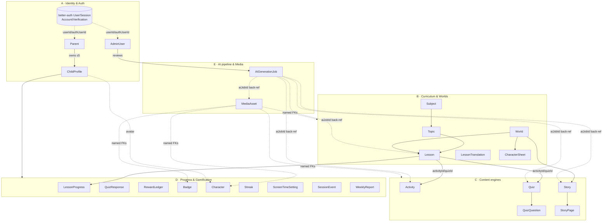
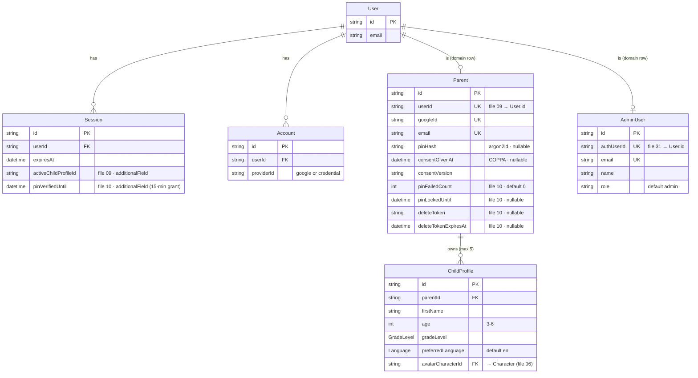
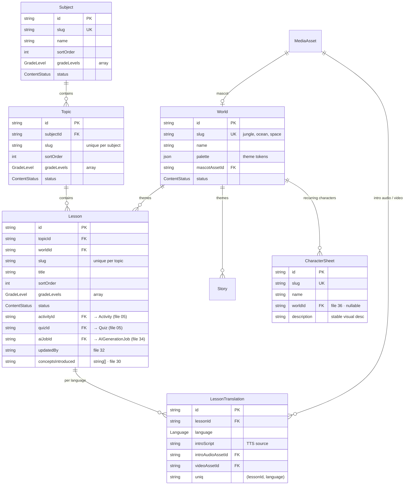
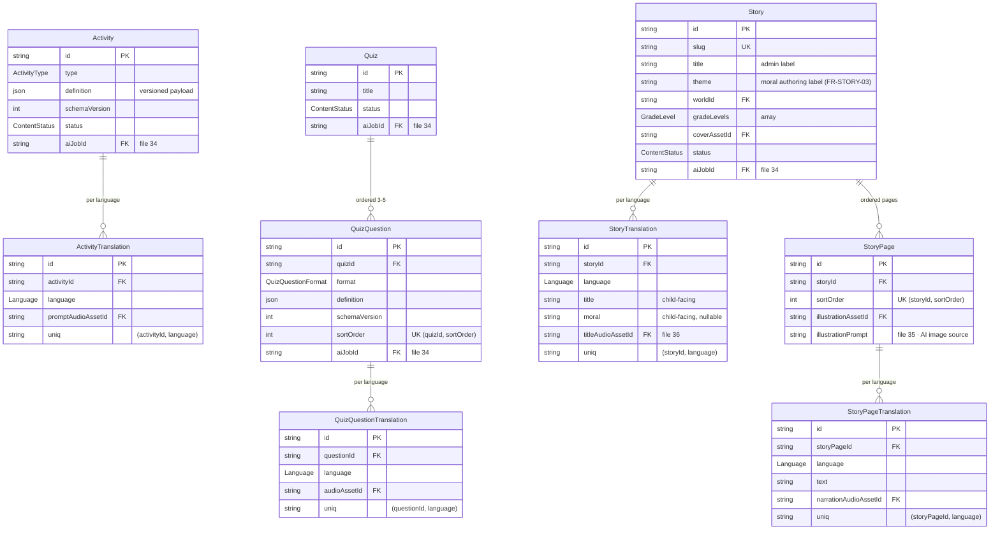
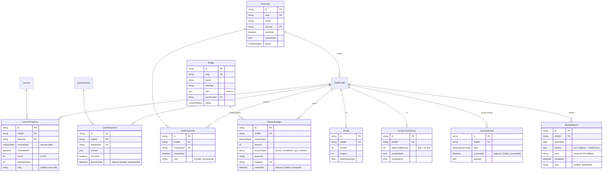
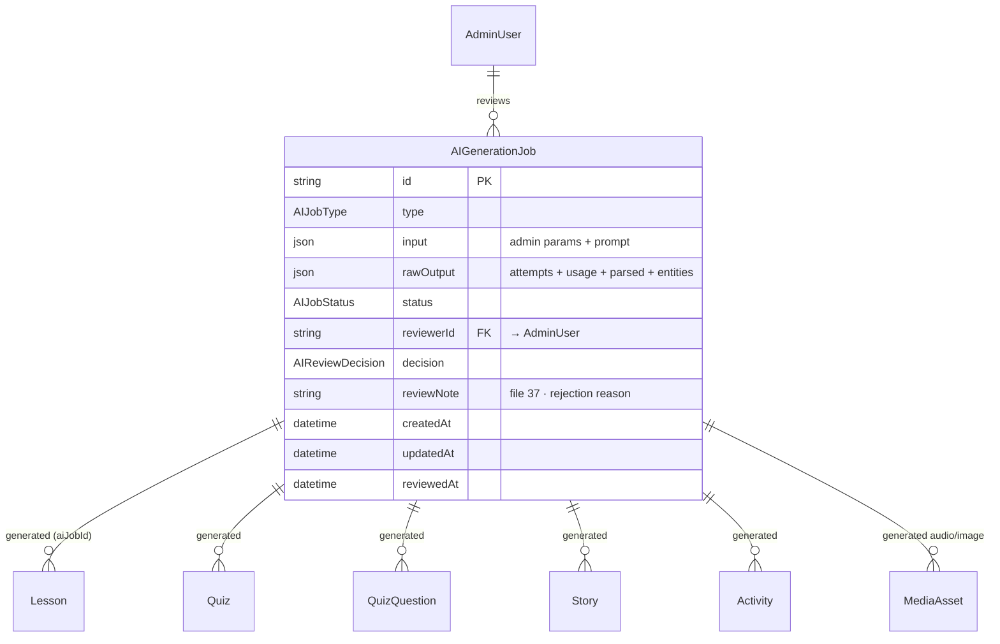
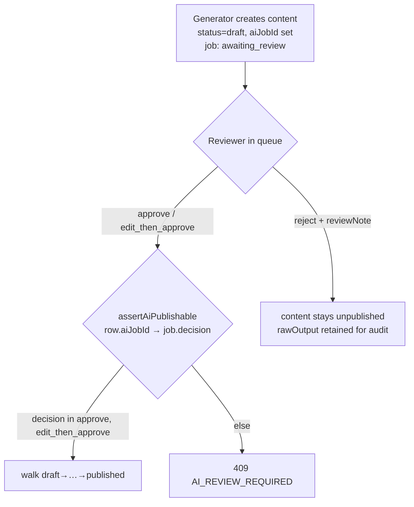

# KidLearn — Database Design

> **Document Type:** Database Design Reference (consolidated schema + ERDs)
> **Version:** 1.0 | **Date:** June 2026
> **Status:** Authoritative consolidated view. The per-file Prisma schema is built incrementally across implementation files **02–06** (core) with additive migrations in **09, 10, 30, 31, 32, 34, 35, 36, 37**. This document shows the **final shape** all those files converge on. Where a field/model is introduced after the core schema, the introducing file is noted.
> **Engine:** PostgreSQL (Supabase free tier) via **Prisma 6**. Auth tables (`User`/`Session`/`Account`/`Verification`) are managed by **better-auth**.

---

## Table of Contents

1. [How to use this document](#1-how-to-use-this-document)
2. [Design conventions & principles](#2-design-conventions--principles)
3. [High-level domain map](#3-high-level-domain-map)
4. [Enum catalog](#4-enum-catalog)
5. [Domain A — Identity & Auth](#5-domain-a--identity--auth)
6. [Domain B — Curriculum & Worlds](#6-domain-b--curriculum--worlds)
7. [Domain C — Content engines (Activity / Quiz / Story)](#7-domain-c--content-engines-activity--quiz--story)
8. [Domain D — Progress & Gamification](#8-domain-d--progress--gamification)
9. [Domain E — AI pipeline & Media](#9-domain-e--ai-pipeline--media)
10. [Cascade & deletion rules](#10-cascade--deletion-rules)
11. [Schema evolution timeline (migrations)](#11-schema-evolution-timeline-migrations)
12. [Alignment decisions resolved](#12-alignment-decisions-resolved)

---

## 1. How to use this document

- **ER diagrams are Mermaid `erDiagram`** blocks, grouped by domain so each stays readable. They render in GitHub/VS Code. Cross-domain foreign keys are noted in prose under each diagram.
- ERDs show **key attributes** (PK / FK / UK + a few defining columns). The **full field list** for every model is in the entity-reference table under each domain.
- A field tagged **(file NN)** is added by that implementation file after the core schema; everything else lands in files 03–06.
- **`§` references** point to `document/project-requirement-details.md`; **`FR-*`** are requirement IDs.

---

## 2. Design conventions & principles

| Convention | Rule |
|---|---|
| **Primary keys** | `id String @id @default(uuid())` everywhere (except better-auth tables, which use their own ids). |
| **Timestamps** | Content/identity models carry `createdAt @default(now())` and `updatedAt @updatedAt`. Event/ledger rows carry only the relevant event timestamp. |
| **Enums over free strings** | Closed sets are Postgres enums (`GradeLevel`, `ContentStatus`, …). Open/extensible rule keys (`Badge.ruleType`) stay `String`. |
| **Locale codes** | `Language` enum values are lowercase `en` / `bn` to match i18next codes end-to-end — no mapping layer. |
| **i18n = translation tables** | Per-language content lives in child `*Translation` tables keyed `(parentId, language)`, never as JSON blobs of all locales. Pattern: `WorldTranslation`, `SubjectTranslation`, `TopicTranslation`, `LessonTranslation`, `ActivityTranslation`, `QuizQuestionTranslation`, `StoryTranslation`, `StoryPageTranslation`. |
| **Display names are translated; the row's own `name`/`title` is the admin label** | `World.name`, `Subject.name`, `Topic.name` and `Lesson.title` are the **internal** label — what the CMS list, an audit log and a slug are built from. They are deliberately not the child-facing string: a tile a Bangla learner reads comes from the matching `*Translation` row, resolved server-side with an `en` fallback exactly as `LessonTranslation.introScript` is. Both exist because they answer different questions, and collapsing them means either an admin list that changes language or a child who cannot read their own curriculum. |
| **Content-as-data** | Activity/quiz payloads are opaque, **versioned `Json`** columns (`definition` + `schemaVersion Int`). The DB never interprets them; `packages/types` Zod schemas (file 07) own their shape. |
| **Media linkage is explicit, never polymorphic** | `MediaAsset` is referenced by **named optional FKs from the owning side** (`World.mascotAssetId`, `LessonTranslation.videoAssetId`, …) — full referential integrity + Prisma type safety, no `entityType`+`entityId`. |
| **Publishing workflow** | Every content root carries `status ContentStatus @default(draft)`. Student-facing queries **always** filter `status = published`. Transition legality is enforced in code (`ALLOWED_TRANSITIONS`, file 32), not a DB table. |
| **Server-authoritative** | Rewards, streaks, screen-time, completion, and learning-time are **derived server-side** from append-only rows (`RewardLedger`, `SessionEvent`). Balances are `SUM(amount)` aggregates — never stored counters — so they can't be spoofed and have no purchase path (FR-GAM-08). |
| **Ownership** | Every child-owned table FKs to `ChildProfile` with `onDelete: Cascade`. Owner-only visibility (FR-PROF-07) is enforced at the API layer by always filtering on `parentId` / session. |
| **Auth boundary** | better-auth owns **credentials & sessions** (`User`/`Session`/`Account`/`Verification`). Our domain rows `Parent` and `AdminUser` own **domain data** and link to `User` via a unique FK (`Parent.userId`, `AdminUser.authUserId`). |

---

## 3. High-level domain map

**Five domains, one spine:** the **content** side (B + C, authored by admins through the **AI pipeline** E) is filtered by `status = published` and a child's grade/language, then consumed in the **student** side, which writes only into **progress/gamification** (D). **Identity** (A) gates who may read/write what.

---

## 4. Enum catalog

| Enum | Values | Introduced | Used by |
|---|---|---|---|
| `GradeLevel` | `NURSERY`, `KG1`, `KG2` | 03 | ChildProfile, Subject, Topic, Lesson, Story |
| `Language` | `en`, `bn` | 03 | ChildProfile, all `*Translation`, MediaAsset |
| `ContentStatus` | `draft`, `in_review`, `approved`, `rejected`, `published`, `archived` | 04 | World, Subject, Topic, Lesson, Activity, Quiz, Story, Badge, Character |
| `MediaKind` | `video`, `audio`, `image` | 04 | MediaAsset |
| `ActivityType` | `drag_drop`, `trace`, `match`, `puzzle` | 05 | Activity |
| `QuizQuestionFormat` | `mcq`, `match_pair`, `drag_answer`, `picture_select` | 05 | QuizQuestion |
| `LessonStep` | `intro`, `video`, `activity`, `quiz`, `reward` | 06 | LessonProgress.currentStep |
| `RewardType` | `star`, `coin`, `badge` | 06 | RewardLedger |
| `SessionEventType` | `heartbeat`, `session_start`, `session_end`, `lesson_start`, `step_complete`, `lesson_complete`, `story_start`, `story_complete` | 06, `step_complete` in 16 | SessionEvent |
| `AIJobType` | `lesson`, `story`, `quiz`, `audio`, `image` | 06 | AIGenerationJob |
| `AIJobStatus` | `pending`, `generating`, `awaiting_review`, `approved`, `rejected`, `failed` | 06 | AIGenerationJob |
| `AIReviewDecision` | `approve`, `edit_then_approve`, `reject` | 06 | AIGenerationJob.decision |

> Adding a grade (Grade 1+) or language (Arabic/Hindi/Spanish) is a **one-line additive enum migration** + data — no code changes (FR-CURR-03, FR-I18N-04, NFR-SCALE-01).

---

## 5. Domain A — Identity & Auth

**Cross-domain FKs:** `ChildProfile.avatarCharacterId` → `Character` (Domain D). Every child-owned table in Domain D FKs back to `ChildProfile`.

**Notes**
- **better-auth owns credentials & sessions.** `User`/`Session`/`Account`/`Verification` are generated by the better-auth CLI (file 09); only the fields KidLearn relies on are shown. `Verification` (email/token rows) is unused at MVP but created by the adapter.
- **Two principals, one auth system.** Parents authenticate with **Google only** (`Account.providerId = "google"`); admins with **email/password** (`providerId = "credential"`, sign-up disabled). `Parent` and `AdminUser` are mutually exclusive domain rows linked to distinct `User`s.
- **Session additional fields** (`activeChildProfileId`, `pinVerifiedUntil`) live on the better-auth `Session`, not on our models — the server stays the single source of truth (FR-AUTH-06, FR-AUTH-04).

### Entity reference — Domain A

| Model | Field | Type | Key / Default | File | Notes |
|---|---|---|---|---|---|
| **Parent** | id | String | PK uuid | 03 | |
| | userId | String | UK | 09 | → better-auth `User.id`; lazily created on first sign-in |
| | googleId | String | UK | 03 | Google profile id |
| | email | String | UK | 03 | |
| | name / avatarUrl | String? | | 03 | from Google profile |
| | pinHash | String? | | 03 | argon2id; null until PIN set (file 10) |
| | consentGivenAt | DateTime? | | 03 | COPPA consent timestamp (FR-AUTH-03) |
| | consentVersion | String? | | 03 | accepted consent-text version |
| | pinFailedCount | Int | @default(0) | 10 | brute-force counter |
| | pinLockedUntil | DateTime? | | 10 | 60s lockout after 5 fails |
| | deleteToken / deleteTokenExpiresAt | String? / DateTime? | | 10 | account-deletion confirm flow |
| | createdAt / updatedAt | DateTime | | 03 | |
| **AdminUser** | id | String | PK uuid | 03 | |
| | authUserId | String? | UK | 31 | → `User.id`; credential lives on User |
| | email | String | UK | 03 | |
| | name | String | | 03 | |
| | role | String | @default("admin") | 03 | |
| | createdAt / updatedAt | DateTime | | 03 | |
| **ChildProfile** | id | String | PK uuid | 03 | |
| | parentId | String | FK → Parent (cascade) | 03 | |
| | firstName | String | | 03 | |
| | age | Int | | 03 | 3–6, validated at API |
| | gradeLevel | GradeLevel | | 03 | content filter (FR-PROF-03) |
| | preferredLanguage | Language | @default(en) | 03 | |
| | avatarCharacterId | String? | FK → Character | 06 | was `avatarCharacterRef String?` in 03; upgraded to FK in 06 |
| | createdAt / updatedAt | DateTime | | 03 | |

---

## 6. Domain B — Curriculum & Worlds

**Cross-domain FKs:** `Lesson.activityId` → `Activity`, `Lesson.quizId` → `Quiz` (Domain C, nullable — a lesson is authorable before its activity/quiz exists; publish-time completeness is an API rule, file 32). `Lesson.aiJobId` → `AIGenerationJob` (Domain E). `Story.worldId` → `World`.

**Notes**
- **`World` is delete-restricted** (Prisma default for the required `Lesson.worldId`/`Story.worldId`): you cannot delete a world that still hosts lessons or stories — archive it (`status: archived`) instead.
- **Grade tags are native enum arrays** (`GradeLevel[]`) on Subject/Topic/Lesson/Story — query with `gradeLevels: { has: child.gradeLevel }`. Chosen over a join table for simpler queries and additive new grades.
- **A published lesson is only servable in a language if a matching `LessonTranslation` row exists.** The read API (file 12) joins by the child's `preferredLanguage` and falls back to `en`.
- **Curriculum display names are translated too** (`WorldTranslation`, `SubjectTranslation`, `TopicTranslation`, and `LessonTranslation.title`). This was corrected after review: the read API's response contract already promised a single resolved string picked from the child's language, but the schema only had the untranslated column to give it, so a `bn` learner got English on every tile while the narration inside the lesson was Bangla. The resolution order is `preferredLanguage → en → the row's own name/title`; the last step is what keeps content authored before a translation existed servable instead of nameless.
- **`Story.title` is translated too**, by `StoryTranslation` — added by file 25 when the story read API landed, following the pattern this note asked for. Same split and same resolution order as the curriculum names: `Story.title`/`Story.theme` stay as the admin label and the authoring label for the moral, and the child reads `StoryTranslation.title`/`.moral`. `moral` is nullable and does **not** fall back to `theme` — an admin note is not a sentence to read to a child.
- **`sortOrder` has no composite-unique** — reordering would collide mid-transaction; the admin API renumbers (file 32). It is indexed for ordered reads.
- **`CharacterSheet`** (file 36) is reference data for the AI image generator (FR-AI-09) — it keeps recurring characters visually consistent. It is not student-facing content and has no `status`.

### Entity reference — Domain B

| Model | Field | Type | Key / Default | File |
|---|---|---|---|---|
| **MediaAsset** | id | String | PK | 04 |
| | url | String | | 04 |
| | kind | MediaKind | | 04 |
| | language | Language? | null = neutral | 04 |
| | aiJobId | String? | FK → AIGenerationJob | 34 |
| | createdAt | DateTime | | 04 |
| **World** | id / slug / name | String | slug UK; `name` = admin label | 04 |
| | palette | Json | theme tokens (FR-WORLD-05) | 04 |
| | mascotAssetId | String? | FK → MediaAsset | 04 |
| | status | ContentStatus | @default(draft) | 04 |
| **WorldTranslation** | id | String | PK | 04 |
| | worldId | String | FK → World (cascade) | 04 |
| | language | Language | UK `(worldId, language)` | 04 |
| | name | String | child-facing world name | 04 |
| **Subject** | id / slug / name | String | slug UK; `name` = admin label | 04 |
| | sortOrder | Int | @default(0), indexed | 04 |
| | gradeLevels | GradeLevel[] | | 04 |
| | status | ContentStatus | @default(draft) | 04 |
| **SubjectTranslation** | id | String | PK | 04 |
| | subjectId | String | FK → Subject (cascade) | 04 |
| | language | Language | UK `(subjectId, language)` | 04 |
| | name | String | child-facing subject name | 04 |
| **Topic** | id | String | PK | 04 |
| | subjectId | String | FK → Subject (cascade) | 04 |
| | slug | String | UK `(subjectId, slug)` | 04 |
| | sortOrder / gradeLevels / status | — | indexed `(subjectId, sortOrder)` | 04 |
| **TopicTranslation** | id | String | PK | 04 |
| | topicId | String | FK → Topic (cascade) | 04 |
| | language | Language | UK `(topicId, language)` | 04 |
| | name | String | child-facing topic name | 04 |
| **Lesson** | id | String | PK | 04 |
| | topicId | String | FK → Topic (cascade) | 04 |
| | worldId | String | FK → World (restrict) | 04 |
| | slug / title | String | UK `(topicId, slug)`; `title` = admin label | 04 |
| | sortOrder / gradeLevels / status | — | indexed `(topicId, sortOrder)`, `(worldId)` | 04 |
| | activityId / quizId | String? | FK → Activity / Quiz | 05 |
| | aiJobId | String? | FK → AIGenerationJob | 34 |
| | conceptsIntroduced | String[] | @default([]) — `letter:A`/`word:apple`/`number:7` | 30 |
| | updatedBy | String? | acting admin id | 32 |
| **LessonTranslation** | id | String | PK | 04 |
| | lessonId | String | FK → Lesson (cascade) | 04 |
| | language | Language | UK `(lessonId, language)` | 04 |
| | title | String | child-facing lesson title | 04 |
| | introScript | String | step-1 spoken greeting (FR-LSN-01) | 04 |
| | introAudioAssetId / videoAssetId | String? | FK → MediaAsset | 04 |
| **CharacterSheet** | id / slug / name | String | slug UK | 36 |
| | worldId | String? | FK → World | 36 |
| | description | String | stable visual description | 36 |
| | createdAt / updatedAt | DateTime | | 36 |

---

## 7. Domain C — Content engines (Activity / Quiz / Story)

**Cross-domain FKs:** all `*AssetId` columns → `MediaAsset` (Domain B). `Story.worldId` → `World`. `Lesson` (Domain B) points **into** here via `activityId`/`quizId`. `QuizQuestion` is referenced by `QuizResponse` (Domain D). `aiJobId` columns → `AIGenerationJob` (Domain E).

**Notes**
- **`definition Json` is opaque & versioned.** The DB stores it verbatim with a sibling `schemaVersion Int @default(1)`; the renderer/validator branch on version (NFR-SCALE-02). Shapes are owned by `packages/types` Zod schemas (file 07).
- **Quiz questions have a collision-free `@@unique([quizId, sortOrder])`** — a quiz is a fixed 3–5 sequence (FR-LSN-04), never admin-reordered like lessons, so a composite unique is safe here.
- **`StoryPage.illustrationPrompt`** (file 35) is the prompt the AI image generator (file 36) consumes; the resulting asset is attached to `illustrationAssetId` only after human approval (file 37).
- **`pending://image` placeholder convention:** AI-generated picture questions store the literal URL `pending://image` for unattached option images. Approval is blocked (409) while any `pending://` remains (file 37). This is a payload convention, not a column.

### Entity reference — Domain C

| Model | Key fields | Constraints | File |
|---|---|---|---|
| **Activity** | `type`, `definition Json`, `schemaVersion`, `status` | — | 05 |
| | `aiJobId String?` | FK → AIGenerationJob | 34 |
| **ActivityTranslation** | `activityId`, `language`, `promptAudioAssetId?` | UK `(activityId, language)`, cascade on Activity | 05 |
| **Quiz** | `title?`, `status` | — | 05 |
| | `aiJobId String?` | FK → AIGenerationJob | 34 |
| **QuizQuestion** | `quizId`, `format`, `definition Json`, `schemaVersion`, `sortOrder` | UK `(quizId, sortOrder)`, cascade on Quiz | 05 |
| | `aiJobId String?` | FK → AIGenerationJob | 34 |
| **QuizQuestionTranslation** | `questionId`, `language`, `audioAssetId?` | UK `(questionId, language)`, cascade on QuizQuestion | 05 |
| **Story** | `slug UK`, `title`, `theme`, `worldId`, `gradeLevels[]`, `coverAssetId?`, `status` | worldId restrict | 05 |
| **StoryTranslation** | `storyId`, `language`, `title`, `moral?`, `titleAudioAssetId?` | UK `(storyId, language)`, cascade on Story | 25 |
| | `aiJobId String?` | FK → AIGenerationJob | 34 |
| **StoryPage** | `storyId`, `sortOrder`, `illustrationAssetId?` | UK `(storyId, sortOrder)`, cascade on Story | 05 |
| | `illustrationPrompt String?` | AI image prompt | 35 |
| **StoryPageTranslation** | `storyPageId`, `language`, `text`, `narrationAudioAssetId?` | UK `(storyPageId, language)`, cascade on StoryPage | 05 |

---

## 8. Domain D — Progress & Gamification

**Cross-domain FKs:** `LessonProgress.lessonId` → `Lesson` (B); `QuizResponse.questionId` → `QuizQuestion` (C); `RewardLedger.badgeId` → `Badge`; `ChildProfile.avatarCharacterId` → `Character`; all asset FKs → `MediaAsset`.

**Notes**
- **Balances are aggregates, not counters.** Stars/coins = `SUM(RewardLedger.amount)` filtered by `rewardType`. Rows are written only by server reward logic (file 23) — no purchase path exists (FR-GAM-08 satisfied by construction).
- **Learning time = event-sourced.** There is **no `LearningTime` table**; minutes (today/week/month) are aggregated from `SessionEvent` rows server-side (file 27) in `APP_TIMEZONE`, so a client refresh can't bypass a limit (FR-TIME-06). This realizes spec §8's "SessionEvent / LearningTime" entity as events + aggregation.
- **Date-only / time-only native types** keep math timezone-stable: `Streak.lastActivityDate @db.Date`, `WeeklyReport.weekStart @db.Date`, `ScreenTimeSetting.windowStart/windowEnd @db.Time(0)`.
- **`WeeklyReport.metrics` carries the structured payload** (active days, minutes, new letters/words/numbers, lessons/stories completed, quiz accuracy **and the first-attempt count it averages** — `quizFirstAttempts`, added by file 30 so `selectNote`'s "≥90% over ≥10 questions" rule stays derivable from a stored row — badges, plus `noteKey`+`noteParams` for i18n). `note String?` is only the rendered **English fallback** (file 30) — there are no separate `noteKey`/`noteParams` columns.
- **`Badge`/`Character` survive child deletion** — they are shared content; only the child-owned join/ledger rows cascade away.

### Entity reference — Domain D (uniques & cascades)

| Model | Unique | Cascades on `ChildProfile` delete | File |
|---|---|---|---|
| LessonProgress | `(childId, lessonId)` (indexed `(childId, completedAt)`) | ✅ | 06, 30 |
| QuizResponse | — (indexed `(childId, answeredAt)`) | ✅ | 06 |
| RewardLedger | — (indexed `(childId, createdAt)`) | ✅ | 06 |
| ChildCharacter | `(childId, characterId)` | ✅ | 06 |
| Streak | `childId` | ✅ | 06 |
| ScreenTimeSetting | `childId` | ✅ | 06 |
| SessionEvent | — (indexed `(childId, occurredAt)`) | ✅ | 06 |
| WeeklyReport | `(childId, weekStart)` | ✅ | 06 |
| Badge | `slug` | ❌ shared content | 06 |
| Character | `slug` | ❌ shared content | 06 |

---

## 9. Domain E — AI pipeline & Media

**Linkage direction:** the job has **no** `lessonId`/`storyId`/`quizId` columns. Each generated content row (and AI-generated `MediaAsset`) carries `aiJobId`; the job resolves its outputs via these **back-relations**. The detail view (file 37) builds previews from `rawOutput.parsed` and "open in editor" links from `rawOutput.entities`.

**The human-review invariant (FR-AI-07, hard requirement):**

`assertAiPublishable(row, tx)` (file 37) runs in **every** `/transition` handler before a row goes `published`: if the row has an `aiJobId`, the linked job's `decision` **must** be `approve` or `edit_then_approve`, else 409. There is no code path that publishes AI-origin content without a recorded human decision.

**Notes**
- **`rawOutput Json` is an opaque audit payload:** `{ attempts: [...], usage: { inputTokens, outputTokens }, parsed: <validated output>, entities: <created-row ids> }`. For audio/image jobs it also records the FK name to set on approval (e.g. `introAudioAssetId`). Generation retries **once** on a schema-validation failure (both attempts retained) before marking `failed`.
- **Generated `MediaAsset`s stay unattached** until approval — they exist in the library with `aiJobId` set but no content row points at them, so they are unreachable by any student query.
- **Daily job caps** (text/audio/image) are enforced in code per `APP_TIMEZONE` day; no rate-limit table.

### Entity reference — AIGenerationJob

| Field | Type | Key / Default | File |
|---|---|---|---|
| id | String | PK | 06 |
| type | AIJobType | | 06 |
| input | Json | admin params + prompt | 06 |
| rawOutput | Json? | `{attempts, usage, parsed, entities}` | 06 |
| status | AIJobStatus | @default(pending), indexed `(status, createdAt)` | 06 |
| reviewerId | String? | FK → AdminUser | 06 |
| decision | AIReviewDecision? | | 06 |
| reviewNote | String? | rejection reason | 37 |
| createdAt / updatedAt / reviewedAt | DateTime / DateTime? | | 06 |

---

## 10. Cascade & deletion rules

| Trigger | Cascades to | Restricted / preserved |
|---|---|---|
| **Delete `Parent`** (account deletion, file 10) | all `ChildProfile`s → (all child-owned tables, see below); then the better-auth `User` → `Session`/`Account` | — |
| **Delete `ChildProfile`** (file 11) | `LessonProgress`, `QuizResponse`, `RewardLedger`, `ChildCharacter`, `Streak`, `ScreenTimeSetting`, `SessionEvent`, `WeeklyReport` | `Badge`, `Character` (shared) survive |
| **Delete `Subject`** | `Topic` → `Lesson` → `LessonTranslation` | — |
| **Delete `Lesson`** | `LessonTranslation`, `LessonProgress` | `Activity`/`Quiz` survive (referenced, not owned) |
| **Delete `Quiz`** | `QuizQuestion` → `QuizQuestionTranslation` | — |
| **Delete `Story`** | `StoryPage` → `StoryPageTranslation` | — |
| **Delete `World`** | — | **Restricted**: fails if any `Lesson`/`Story` references it → archive instead |

> **GDPR / COPPA:** parent-account deletion is **synchronous and complete** (no soft-delete of child PII), satisfying NFR-SAFE-05/06 right-to-erasure. The compliance mapping is recorded in `document/implementation/notes/compliance-consent-deletion.md` (file 10).

---

## 11. Schema evolution timeline (migrations)

The schema is built additively. Each migration is named and owned by one file:

| Order | Migration (file) | Adds |
|---|---|---|
| 1 | `auth_profile_schema` (03) | `GradeLevel`, `Language` enums; `Parent`, `AdminUser`, `ChildProfile` |
| 2 | `add_better_auth_tables` (09) | better-auth `User`/`Session`/`Account`/`Verification`; `Parent.userId`; `Session.activeChildProfileId` |
| 3 | `parent_pin_consent_deletion` (10) | `Parent.pinFailedCount`, `pinLockedUntil`, `deleteToken`, `deleteTokenExpiresAt`; `Session.pinVerifiedUntil` |
| 4 | `curriculum_world_schema` (04) | `ContentStatus`, `MediaKind`; `MediaAsset`, `World`, `Subject`, `Topic`, `Lesson`, `LessonTranslation` |
| 5 | `activity_quiz_story_schema` (05) | `ActivityType`, `QuizQuestionFormat`; `Activity(+Translation)`, `Quiz`, `QuizQuestion(+Translation)`, `Story`, `StoryPage(+Translation)`; FK-upgrade `Lesson.activityId/quizId` |
| 6 | `progress_gamification_schema` (06) | 7 enums; `LessonProgress`, `QuizResponse`, `Badge`, `RewardLedger`, `Character`, `ChildCharacter`, `Streak`, `ScreenTimeSetting`, `SessionEvent`, `WeeklyReport`, `AIGenerationJob`; `ChildProfile.avatarCharacterId` FK |
| 7 | `session_event_step_complete` (16) | `SessionEventType.step_complete` — the per-step marker file 06's enum omitted |
| 8 | `story_translations` (25) | `StoryTranslation` model — the child-facing story title, moral and title narration the `Story.title` note in §6 deferred to files 25–26 |
| 9 | `weekly_report_concepts` (30) | `Lesson.conceptsIntroduced String[]`; index `LessonProgress(childId, completedAt)` — the weekly report selects one child's completions inside a seven-day window, which the `(childId, lessonId)` unique cannot serve |
| 10 | `admin_auth_link` (31) | `AdminUser.authUserId` |
| 11 | `content_audit_fields` (32) | `updatedBy String?` on `World`/`Subject`/`Topic`/`Lesson` |
| 12 | `ai_job_linkage` (34) | `aiJobId String?` on `Lesson`, `Quiz`, `QuizQuestion`, `Story`, `Activity`, `MediaAsset` |
| 13 | `storypage_illustration_prompt` (35) | `StoryPage.illustrationPrompt String?` |
| 14 | `character_sheets` (36) | `CharacterSheet` model |
| 15 | `ai_job_review_note` (37) | `AIGenerationJob.reviewNote String?` |

> **Ordering note:** files 04–06 (core content/progress) are authored before the auth-detail and AI-pipeline files in implementation sequence, but several migrations interleave. The exact `prisma migrate` order is the file number order above; the **end state** is what this document describes. Confirm migration names when running `pnpm db:migrate`.

---

## 12. Alignment decisions resolved

While consolidating this design, two genuine cross-document conflicts and several "incomplete-canonical" gaps were found and fixed so all docs agree (this is what keeps multiple developers on the same track):

| # | Issue | Where it diverged | Resolution |
|---|---|---|---|
| 1 | **Consent column name** | doc 03 = `consentGivenAt`; docs 09 & 10 used `consentAt` (doc 10 even hedged "if file 03 named them differently, adapt") | **Canonical = `consentGivenAt`.** Docs 09 & 10 updated to use it; the hedge removed. |
| 2 | **Admin credentials** | doc 03 = `AdminUser.passwordHash`; doc 31 = better-auth credential + `AdminUser.authUserId`, no passwordHash | **better-auth wins** (doc 31 is the authoritative admin-auth design). `passwordHash` removed from doc 03; `authUserId` added by file 31. |
| 3 | `aiJobId` on content rows | assumed by files 34/35/37, absent from canonical 04/05 | Documented as a file-34 additive migration; forward-ref notes added to docs 04 & 05. |
| 4 | `AIGenerationJob.reviewNote` | added by file 37, absent from canonical 06 | Documented as a file-37 migration; forward-ref note added to doc 06. |
| 5 | `StoryPage.illustrationPrompt` | added by file 35 | Forward-ref note added to doc 05. |
| 6 | `Lesson.conceptsIntroduced` | added by file 30 | Forward-ref note added to doc 04. |
| 7 | `CharacterSheet` model | added by file 36 | Forward-ref note added to doc 04. |
| 8 | `updatedBy` audit field | added by file 32 | Forward-ref note added to doc 06. |
| 9 | `WeeklyReport` note storage | `noteKey`/`noteParams` could read as columns | Clarified: they live **inside `metrics Json`**; `note String?` is the English fallback. |

Each canonical schema doc (03–06) now ends with a **"Schema additions in later files"** section pointing here, so a developer reading any one doc sees the full trajectory.

---

_End of Database Design — KidLearn v1.0_
