# KidLearn — User Journey & User Manual

> **Document Type:** User Journey Maps + User Manual (UX foundation)
> **Version:** 1.0 | **Date:** June 2026
> **Audience:** Product, design, and engineering teams.
> **Purpose:** Describe — screen by screen, tap by tap — how the three users (Student, Parent, Admin) actually experience KidLearn. This is the reference for crafting and refining UX. The flows here are grounded in `document/project-requirement-details.md` and the `document/implementation/` specs.
>
> **The north star:** For the **student**, every moment must feel like play, never like a test. A 3-year-old who cannot read must be able to use the app alone, guided by voice, and *want* to come back tomorrow. This document treats the child's emotional journey as a first-class requirement, not an afterthought.

---

## Table of Contents

1. [How to read this document](#1-how-to-read-this-document)
2. [The three users at a glance](#2-the-three-users-at-a-glance)
3. [System map — how the portals connect](#3-system-map--how-the-portals-connect)
4. [Student journey — the heart of the product](#4-student-journey--the-heart-of-the-product)
   - 4.1 [Emotional journey overview](#41-emotional-journey-overview)
   - 4.2 [Picking a profile & arriving home](#42-picking-a-profile--arriving-home)
   - 4.3 [The 5-step lesson adventure](#43-the-5-step-lesson-adventure)
   - 4.4 [The four activity types](#44-the-four-activity-types)
   - 4.5 [The quiz — low-pressure by design](#45-the-quiz--low-pressure-by-design)
   - 4.6 [The reward celebration](#46-the-reward-celebration)
   - 4.7 [Badges, characters & streaks](#47-badges-characters--streaks)
   - 4.8 [Story library & reader](#48-story-library--reader)
   - 4.9 [When time is up — kind boundaries](#49-when-time-is-up--kind-boundaries)
   - 4.10 [Kid-UX golden rules](#410-kid-ux-golden-rules)
5. [Parent journey](#5-parent-journey)
   - 5.1 [First-time setup](#51-first-time-setup)
   - 5.2 [The PIN gate](#52-the-pin-gate)
   - 5.3 [Managing child profiles](#53-managing-child-profiles)
   - 5.4 [The dashboard](#54-the-dashboard)
   - 5.5 [Weekly reports](#55-weekly-reports)
   - 5.6 [Screen-time controls](#56-screen-time-controls)
   - 5.7 [Account & data deletion](#57-account--data-deletion)
6. [Admin journey](#6-admin-journey)
   - 6.1 [Login & workspace](#61-login--workspace)
   - 6.2 [Building the curriculum](#62-building-the-curriculum)
   - 6.3 [Media & content editors](#63-media--content-editors)
   - 6.4 [The AI generation pipeline](#64-the-ai-generation-pipeline)
   - 6.5 [The review queue — the human gate](#65-the-review-queue--the-human-gate)
   - 6.6 [Publishing lifecycle](#66-publishing-lifecycle)
7. [Cross-cutting: how content reaches a child](#7-cross-cutting-how-content-reaches-a-child)
8. [UX principles summary](#8-ux-principles-summary)

---

## 1. How to read this document

- **Flowcharts are written in Mermaid** and render automatically in GitHub, VS Code, and most markdown viewers. If they appear as code, install a Mermaid preview extension.
- **Shapes:** rounded boxes = screens the user sees; diamonds = decisions/branches; plain boxes = actions or system steps.
- Each persona section opens with a **journey map**, then drills into **screen-by-screen detail**.
- 🎈 marks **kid-delight notes** — moments engineered specifically to make children smile.
- 🔒 marks **safety/gating notes**.

---

## 2. The three users at a glance

| | 👧 Student (3–6) | 👩 Parent | 🛠️ Admin (internal) |
|---|---|---|---|
| **Goal** | Play, learn, feel proud | Watch progress, set safe limits | Produce & approve content |
| **Reading required?** | **None** — voice-first | Yes | Yes |
| **Enters via** | Tapping their avatar | Google sign-in | Email + password |
| **Surface** | Immersive, gamified, world-themed | Clean dashboard behind a PIN | Plain desktop CMS |
| **Can they leave the app?** | No external links, no ads, no chat | — | — |
| **Theme** | `data-theme="kid"` | `data-theme="parent"` | `data-theme="parent"` |

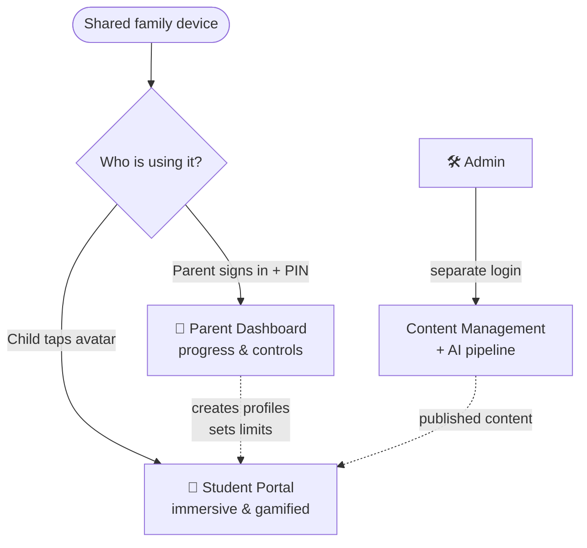
```mermaid
flowchart TD
    Device([Shared family device]) --> Login{Who is using it?}
    Login -->|Child taps avatar| Student[👧 Student Portal<br/>immersive & gamified]
    Login -->|Parent signs in + PIN| Parent[👩 Parent Dashboard<br/>progress & controls]
    Admin[🛠️ Admin] -->|separate login| CMS[Content Management<br/>+ AI pipeline]
    CMS -.published content.-> Student
    Parent -.creates profiles<br/>sets limits.-> Student
```

> **Key relationship:** the parent *enables and bounds* the child's experience; the admin *fills it with content*; the child *lives in it*. The child never sees the machinery — only the adventure.

---

## 3. System map — how the portals connect

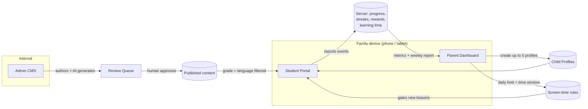
```mermaid
flowchart LR
    subgraph Family["Family device (phone / tablet)"]
        SP[Student Portal]
        PD[Parent Dashboard]
    end
    subgraph Internal["Internal"]
        AD[Admin CMS]
    end

    AD -->|authors + AI-generates| RQ[Review Queue]
    RQ -->|human approves| PUB[(Published content)]
    PUB -->|grade + language filtered| SP

    PD -->|create up to 5 profiles| PROF[(Child Profiles)]
    PD -->|daily limit + time window| LIMITS[(Screen-time rules)]
    PROF --> SP
    LIMITS -->|gates new lessons| SP

    SP -->|reports events| SRV[(Server: progress,<br/>streaks, rewards,<br/>learning time)]
    SRV -->|metrics + weekly report| PD
```

**Three architectural truths that shape every journey:**

1. **Server-authoritative progress.** Stars, coins, streaks, completion, and minutes are computed and validated server-side. The client only *reports* events — so a child cannot cheat and a refresh cannot bypass a time limit.
2. **Content-as-data.** Lessons, activities, quizzes, and stories are JSON payloads rendered by generic engines. New content is data, not code — which is why the admin's job is *authoring*, not *programming*.
3. **Review-gated publishing.** Nothing reaches a child until a human approves it. The student query only ever sees `status = "published"`.

---

## 4. Student journey — the heart of the product

> This is the section that matters most. **Kids have to enjoy this app.** A child won't read a manual, won't tolerate friction, and won't forgive a "wrong answer" buzzer. Everything below is engineered around delight, encouragement, and zero failure.

### 4.1 Emotional journey overview

The whole student experience is a deliberate emotional arc — from curiosity to mastery to pride — repeated daily so the child *wants* to return.

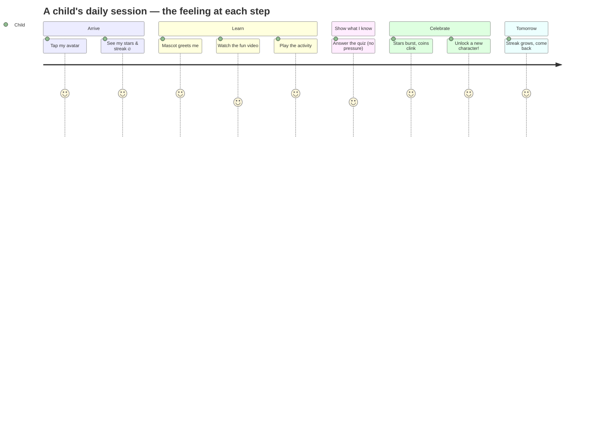
```mermaid
journey
    title A child's daily session — the feeling at each step
    section Arrive
      Tap my avatar: 5: Child
      See my stars & streak 🔥: 5: Child
    section Learn
      Mascot greets me: 5: Child
      Watch the fun video: 4: Child
      Play the activity: 5: Child
    section Show what I know
      Answer the quiz (no pressure): 4: Child
    section Celebrate
      Stars burst, coins clink: 5: Child
      Unlock a new character!: 5: Child
    section Tomorrow
      Streak grows, come back: 5: Child
```

🎈 **Design intent:** the curve must *peak at celebration* and *never dip into frustration*. There is no "fail" valley anywhere — wrong answers are gentle nudges, not setbacks.

### 4.2 Picking a profile & arriving home

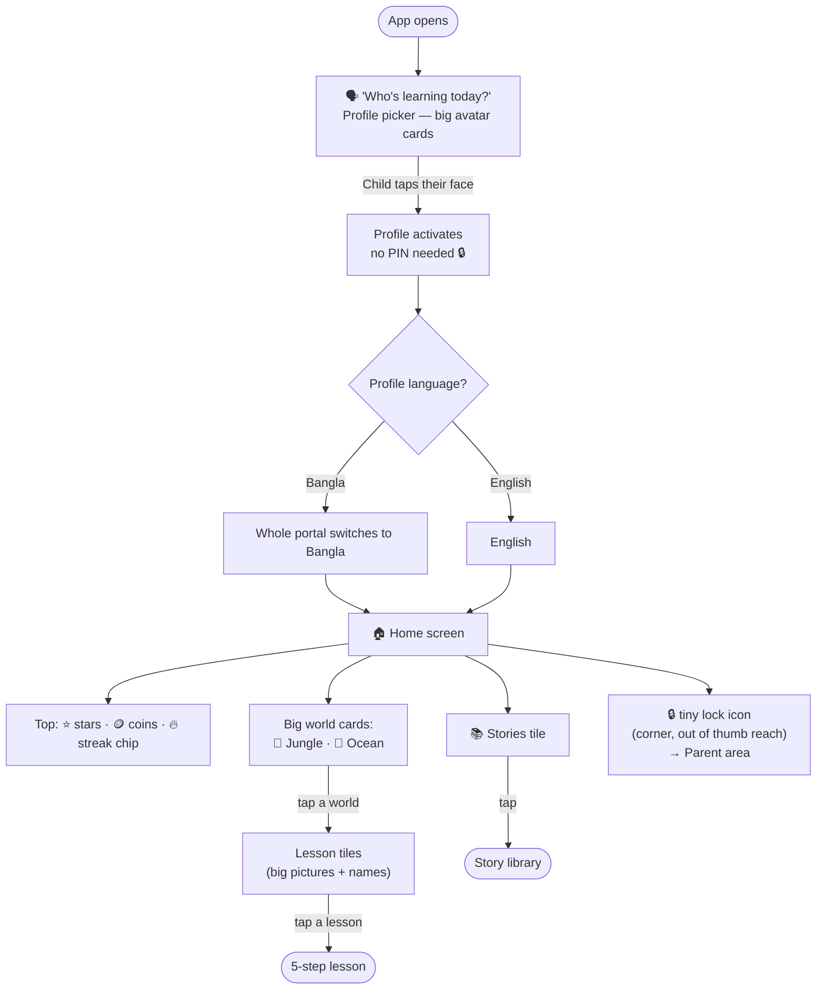
```mermaid
flowchart TD
    Start([App opens]) --> PS["🗣️ 'Who's learning today?'<br/>Profile picker — big avatar cards"]
    PS -->|Child taps their face| ACT[Profile activates<br/>no PIN needed 🔒]
    ACT --> Lang{Profile language?}
    Lang -->|Bangla| BN[Whole portal switches to Bangla]
    Lang -->|English| EN[English]
    BN --> Home
    EN --> Home["🏠 Home screen"]

    Home --> Strip["Top: ⭐ stars · 🪙 coins · 🔥 streak chip"]
    Home --> Worlds["Big world cards:<br/>🌴 Jungle · 🌊 Ocean"]
    Home --> Stories["📚 Stories tile"]
    Home --> Lock["🔒 tiny lock icon<br/>(corner, out of thumb reach)<br/>→ Parent area"]

    Worlds -->|tap a world| Browse["Lesson tiles<br/>(big pictures + names)"]
    Browse -->|tap a lesson| Lesson([5-step lesson])
    Stories -->|tap| Library([Story library])
```

**Screen-by-screen:**

- **Profile picker (`/select-profile`)** — Full-screen, large avatar cards (≥120px). On load, a voice asks *"Who's learning today?"* The child taps their face. **No PIN** — switching between siblings is friction-free by design (FR-AUTH-06).
- **Home (`/home`)** — Immersive and world-themed:
  - **Reward strip** at top: star count, coin count, and a **streak chip** shown as `🔥 3`. 🎈 For a brand-new child the flame is dimmed with *"Start a streak!"* — the goal is always visible, never hidden.
  - **World cards** — large gradient cards with the world's mascot and name. Tapping one opens that world's lessons; 🎈 the lesson/world name *plays aloud* on tap so pre-readers navigate by ear.
  - **Lesson tiles** — big picture thumbnails with names (≥20px). One tap = open.
  - **🔒 Lock icon** — pinned to a top corner, deliberately *outside the thumb zone* so a child won't tap it by accident. It leads to the PIN-gated parent area.
- **Orientation:** portrait stacks cards vertically (lessons 2-up); landscape places them side-by-side (lessons 3–4-up). Never any horizontal scrolling.

### 4.3 The 5-step lesson adventure

Every single lesson follows the **same five steps in the same order**, so the child always knows what comes next. Predictability is comfort. Five progress dots at the top show where they are.

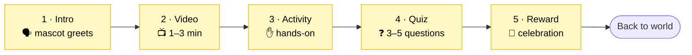
```mermaid
flowchart LR
    I["1 · Intro<br/>🗣️ mascot greets"] --> V["2 · Video<br/>📺 1–3 min"]
    V --> A["3 · Activity<br/>✋ hands-on"]
    A --> Q["4 · Quiz<br/>❓ 3–5 questions"]
    Q --> R["5 · Reward<br/>🎉 celebration"]
    R --> Done([Back to world])

    classDef step fill:#fef9c3,stroke:#eab308,color:#000;
    class I,V,A,Q,R step;
```

> 🔒 **Resume-safe:** progress saves per step. If the device dies mid-lesson, the child resumes from the last completed step — never starts over.

**Step-by-step experience:**

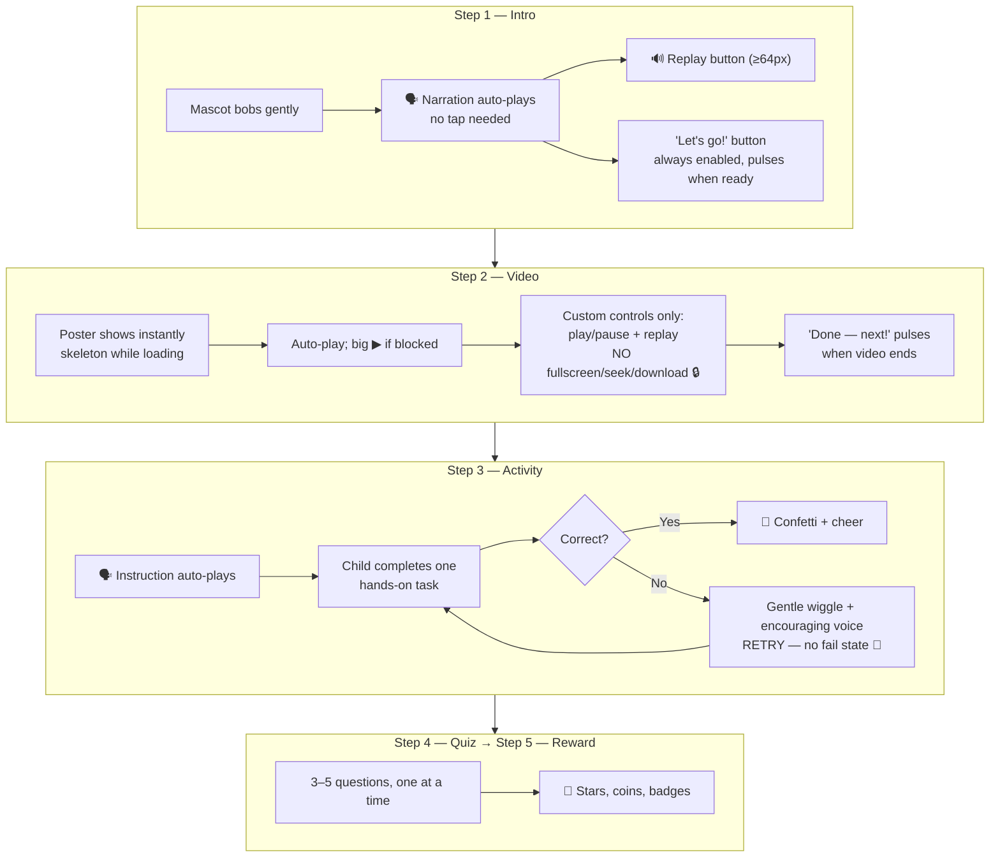
```mermaid
flowchart TD
    subgraph S1["Step 1 — Intro"]
        I1[Mascot bobs gently] --> I2[🗣️ Narration auto-plays<br/>no tap needed]
        I2 --> I3["🔊 Replay button (≥64px)"]
        I2 --> I4["'Let's go!' button<br/>always enabled, pulses when ready"]
    end
    subgraph S2["Step 2 — Video"]
        V1[Poster shows instantly<br/>skeleton while loading] --> V2[Auto-play; big ▶ if blocked]
        V2 --> V3[Custom controls only:<br/>play/pause + replay<br/>NO fullscreen/seek/download 🔒]
        V3 --> V4["'Done — next!' pulses<br/>when video ends"]
    end
    subgraph S3["Step 3 — Activity"]
        A1[🗣️ Instruction auto-plays] --> A2[Child completes one<br/>hands-on task]
        A2 --> A3{Correct?}
        A3 -->|Yes| A4[🎉 Confetti + cheer]
        A3 -->|No| A5[Gentle wiggle + encouraging voice<br/>RETRY — no fail state 🎈]
        A5 --> A2
    end
    S1 --> S2 --> S3 --> S4
    subgraph S4["Step 4 — Quiz → Step 5 — Reward"]
        direction LR
        Q1[3–5 questions, one at a time] --> RWD[🎉 Stars, coins, badges]
    end
```

- **Intro** — The world mascot appears and *speaks* what the child will learn. The `Let's go!` button is **always tappable** — 🎈 we never trap a child waiting for audio to finish.
- **Video** — A 1–3 minute animated clip with narration. 🔒 **No native player controls** (no fullscreen, no seek bar, no download) so the child can't wander off or get stuck. They can rewatch freely; nothing penalizes replays.
- **Activity** — One hands-on practice task (see §4.4).
- **Quiz** — 3–5 gentle questions (see §4.5).
- **Reward** — The celebration payoff (see §4.6).

### 4.4 The four activity types

All four share the same emotional contract: **immediate, joyful feedback on success; a soft, encouraging nudge on a miss; infinite retries; no score, no failure, ever.**

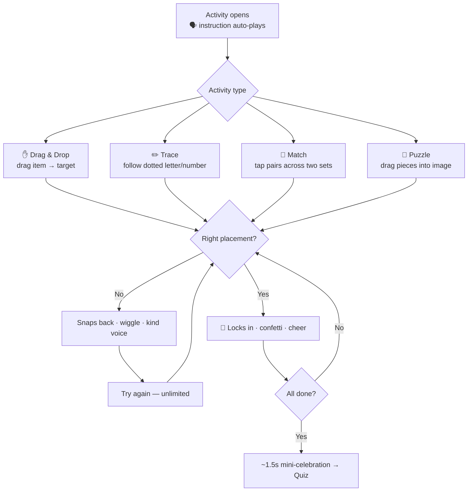
```mermaid
flowchart TD
    Entry[Activity opens<br/>🗣️ instruction auto-plays] --> Type{Activity type}

    Type --> DD["✋ Drag & Drop<br/>drag item → target"]
    Type --> TR["✏️ Trace<br/>follow dotted letter/number"]
    Type --> MA["🔗 Match<br/>tap pairs across two sets"]
    Type --> PZ["🧩 Puzzle<br/>drag pieces into image"]

    DD --> FB
    TR --> FB
    MA --> FB
    PZ --> FB
    FB{Right placement?}
    FB -->|Yes| Win[🎉 Locks in · confetti · cheer]
    FB -->|No| Soft[Snaps back · wiggle · kind voice]
    Soft --> Retry[Try again — unlimited] --> FB
    Win --> Complete{All done?}
    Complete -->|No| FB
    Complete -->|Yes| Cele[~1.5s mini-celebration → Quiz]
```

| Type | What the child does | Success feel | Miss feel |
|------|--------------------|--------------|-----------|
| **Drag & Drop** | Drags item cards from a tray onto big target zones (≥64px) | Item locks + confetti burst at finger + cheer | Snaps back to tray with a wiggle + warm voice |
| **Trace** | Traces a dotted letter/number; a crayon ink-trail follows the finger | 🎈 Tolerant — only ~90% coverage needed; drift is fine; each completed stroke cheers | Drifting off-path triggers *no* error; continue where you left off |
| **Match** | Taps a card, then its pair in the other set | Both lock with a shared pastel color + a line drawn between them + cheer | Both wiggle, selection clears, try again |
| **Puzzle** | Drags image pieces onto a faint "ghost" of the full picture | Piece snaps to full opacity + locks; full image shines when done | Piece snaps back to tray + wiggle |

🎈 **Why this works for kids:** the child is *never wrong* — only "not yet." The wiggle reads as playful, the voice stays warm, and there's no counter shaming them. Mastery comes from safe repetition.

### 4.5 The quiz — low-pressure by design

Quizzes end every lesson but must feel like **more play, not an exam**. One question at a time, read aloud, with a friendly "fruit dot" progress strip.

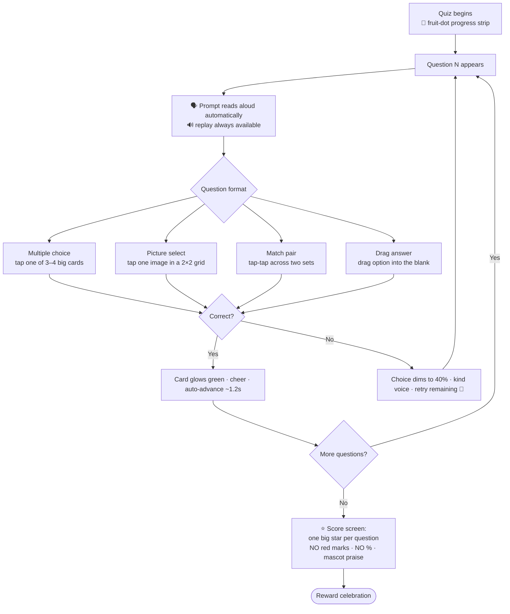
```mermaid
flowchart TD
    Start[Quiz begins<br/>🍎 fruit-dot progress strip] --> Qn[Question N appears]
    Qn --> Audio[🗣️ Prompt reads aloud automatically<br/>🔊 replay always available]
    Audio --> Fmt{Question format}
    Fmt --> MCQ["Multiple choice<br/>tap one of 3–4 big cards"]
    Fmt --> Pic["Picture select<br/>tap one image in a 2×2 grid"]
    Fmt --> Pair["Match pair<br/>tap-tap across two sets"]
    Fmt --> Drag["Drag answer<br/>drag option into the blank"]

    MCQ --> Ans{Correct?}
    Pic --> Ans
    Pair --> Ans
    Drag --> Ans
    Ans -->|Yes| Right[Card glows green · cheer · auto-advance ~1.2s]
    Ans -->|No| Wrong[Choice dims to 40% · kind voice · retry remaining 🎈]
    Wrong --> Qn
    Right --> More{More questions?}
    More -->|Yes| Qn
    More -->|No| Score[⭐ Score screen:<br/>one big star per question<br/>NO red marks · NO % · mascot praise]
    Score --> Reward([Reward celebration])
```

🎈 **No-pressure guarantees:**
- **A single tap commits** — no "select then confirm" double-step.
- **Wrong answers dim gently** (40% opacity) and play an *encouraging* voice — never a red ✗, never a buzzer.
- **The score screen never shows a percentage or grey/empty stars.** It shows a filled star per question and the mascot always praises the child, regardless of score.
- The child cannot "lose."

### 4.6 The reward celebration

This is the **emotional peak** of every lesson — the moment that makes a child want to do "just one more."

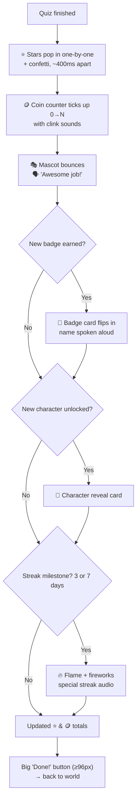
```mermaid
flowchart TD
    Done[Quiz finished] --> Stars[⭐ Stars pop in one-by-one<br/>+ confetti, ~400ms apart]
    Stars --> Coins[🪙 Coin counter ticks up 0→N<br/>with clink sounds]
    Coins --> Mascot[🎭 Mascot bounces<br/>🗣️ 'Awesome job!']
    Mascot --> Badge{New badge earned?}
    Badge -->|Yes| BadgeCard[🏅 Badge card flips in<br/>name spoken aloud]
    Badge -->|No| CharCheck
    BadgeCard --> CharCheck{New character unlocked?}
    CharCheck -->|Yes| CharCard[🦁 Character reveal card]
    CharCheck -->|No| StreakCheck
    CharCard --> StreakCheck{Streak milestone? 3 or 7 days}
    StreakCheck -->|Yes| Fire[🔥 Flame + fireworks<br/>special streak audio]
    StreakCheck -->|No| Totals
    Fire --> Totals[Updated ⭐ & 🪙 totals]
    Totals --> DoneBtn["Big 'Done!' button (≥96px)<br/>→ back to world"]
```

**What's earned (server-computed):**
- **+2 stars** for completing the lesson, **+1 star** for attempting the quiz.
- **+2 coins** per correct quiz answer.
- **+5 coins** once per day for the first activity completed.

🎈 **Resilience:** even if the network hiccups and the server can't confirm, **the celebration still plays warmly** — the child never sees an error or blank screen. And on a *replay*, the celebration is identical even though no new rewards are granted — the child never feels "this counted for nothing."

♿ All celebrations respect `prefers-reduced-motion`: animations become calm static reveals, and the flame loop is disabled for motion-sensitive children.

### 4.7 Badges, characters & streaks

Three long-term motivators that pull the child back day after day.

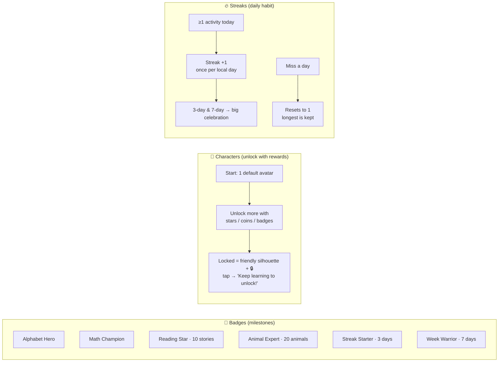
```mermaid
flowchart LR
    subgraph Badges["🏅 Badges (milestones)"]
        B1[Alphabet Hero]
        B2[Math Champion]
        B3[Reading Star · 10 stories]
        B4[Animal Expert · 20 animals]
        B5[Streak Starter · 3 days]
        B6[Week Warrior · 7 days]
    end
    subgraph Chars["🦁 Characters (unlock with rewards)"]
        C0[Start: 1 default avatar] --> C1[Unlock more with<br/>stars / coins / badges]
        C1 --> CLock[Locked = friendly silhouette + 🔒<br/>tap → 'Keep learning to unlock!']
    end
    subgraph Streak["🔥 Streaks (daily habit)"]
        S0[≥1 activity today] --> S1[Streak +1<br/>once per local day]
        S1 --> S2[3-day & 7-day → big celebration]
        Gap[Miss a day] --> Reset[Resets to 1<br/>longest is kept]
    end
```

🎈 **Locked characters are aspirational, not punishing:** they appear as friendly silhouettes; tapping one plays *"Keep learning to unlock!"* — never an error tone. The child sees the prize they're working toward.

### 4.8 Story library & reader

A calm, always-available corner — separate from lessons — for read-along stories.

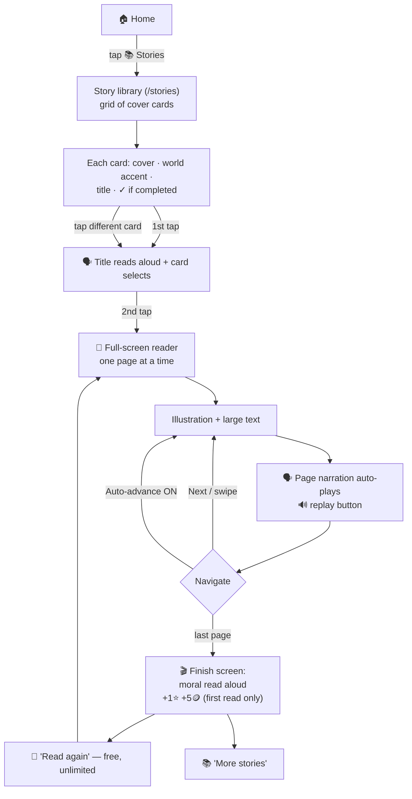
```mermaid
flowchart TD
    Home[🏠 Home] -->|tap 📚 Stories| Lib["Story library (/stories)<br/>grid of cover cards"]
    Lib --> Card["Each card: cover · world accent ·<br/>title · ✓ if completed"]
    Card -->|1st tap| Speak[🗣️ Title reads aloud + card selects]
    Speak -->|2nd tap| Reader
    Card -->|tap different card| Speak

    Reader["📖 Full-screen reader<br/>one page at a time"] --> Page[Illustration + large text]
    Page --> Narr[🗣️ Page narration auto-plays<br/>🔊 replay button]
    Narr --> Nav{Navigate}
    Nav -->|Next / swipe| Page
    Nav -->|Auto-advance ON| Page
    Nav -->|last page| Finish["🎬 Finish screen:<br/>moral read aloud<br/>+1⭐ +5🪙 (first read only)"]
    Finish --> Again[📕 'Read again' — free, unlimited]
    Finish --> Back[📚 'More stories']
    Again --> Reader
```

- **Reading earns a small reward once** (1 star + 5 coins on first completion); 🎈 **replays are unlimited and free**, encouraging the re-reading that builds fluency.
- **Orientation:** portrait = illustration on top, text below; landscape = illustration left, text + controls right.
- **Auto-advance** (on by default) turns each page ~1.5s after narration ends — a hands-free read-along for the youngest users. Manual navigation cancels it.

### 4.9 When time is up — kind boundaries

Screen-time limits (set by the parent) must feel like a caring character saying goodnight, **never** a punishment or error.

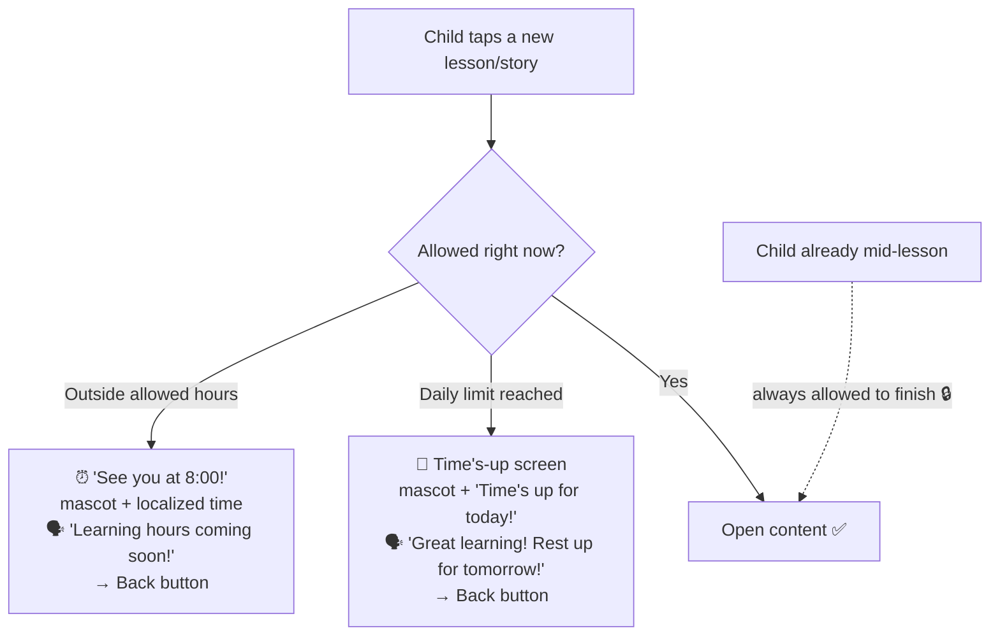
```mermaid
flowchart TD
    Tap[Child taps a new lesson/story] --> Check{Allowed right now?}
    Check -->|Yes| Open[Open content ✅]
    Check -->|Daily limit reached| TU["🌙 Time's-up screen<br/>mascot + 'Time's up for today!'<br/>🗣️ 'Great learning! Rest up for tomorrow!'<br/>→ Back button"]
    Check -->|Outside allowed hours| OW["⏰ 'See you at 8:00!'<br/>mascot + localized time<br/>🗣️ 'Learning hours coming soon!'<br/>→ Back button"]

    InProgress[Child already mid-lesson] -.always allowed to finish 🔒.-> Open
```

🎈 **Tone is everything:** no harsh red, no countdown timer, no "you're not allowed." Just the mascot, a warm voice, and a single friendly **Back** button. 🔒 A lesson already in progress is *always* allowed to finish — the child is never cut off mid-activity.

### 4.10 Kid-UX golden rules

These are the non-negotiable rules that protect the child's joy. Every new screen must pass all ten.

| # | Rule | Why it matters to a child |
|---|------|---------------------------|
| 1 | **No fail states** | A 4-year-old quits forever after one "wrong" buzzer. |
| 2 | **Voice-first** | Pre-readers must operate everything by ear. |
| 3 | **Huge touch targets (≥64px)** | Small fingers, low precision. |
| 4 | **One thing at a time** | No menus, no choices to overwhelm. |
| 5 | **Instant feedback** | Taps respond at the moment of contact. |
| 6 | **Predictable structure** | Same 5 steps every lesson = comfort. |
| 7 | **Celebration over scoring** | The payoff is joy, not a grade. |
| 8 | **Always an escape** | A safe Back/Home corner, never forced. |
| 9 | **Respect reduced-motion** | Comfort for sensitive kids. |
| 10 | **World immersion** | Mascots + themes make it play, not school. |

---

## 5. Parent journey

The parent is the **gatekeeper and observer**. Their journey is efficient, trust-building, and safety-first.

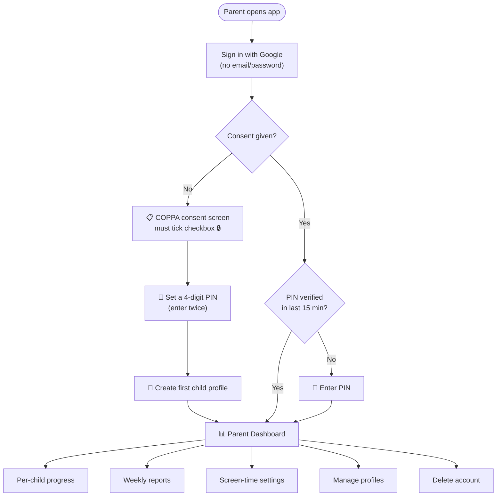
```mermaid
flowchart TD
    Start([Parent opens app]) --> Google["Sign in with Google<br/>(no email/password)"]
    Google --> Consent{Consent given?}
    Consent -->|No| C["📋 COPPA consent screen<br/>must tick checkbox 🔒"]
    C --> PIN["🔢 Set a 4-digit PIN<br/>(enter twice)"]
    PIN --> Child1["👶 Create first child profile"]
    Child1 --> Dash
    Consent -->|Yes| Gate{PIN verified<br/>in last 15 min?}
    Gate -->|No| PinModal["🔢 Enter PIN"]
    Gate -->|Yes| Dash
    PinModal --> Dash["📊 Parent Dashboard"]

    Dash --> D1[Per-child progress]
    Dash --> D2[Weekly reports]
    Dash --> D3[Screen-time settings]
    Dash --> D4[Manage profiles]
    Dash --> D5[Delete account]
```

### 5.1 First-time setup

A mandatory, ordered onboarding the very first time a parent signs in:

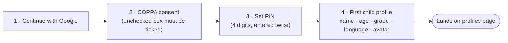
```mermaid
flowchart LR
    L["1 · Continue with Google"] --> Co["2 · COPPA consent<br/>(unchecked box must be ticked)"]
    Co --> P["3 · Set PIN<br/>(4 digits, entered twice)"]
    P --> Ch["4 · First child profile<br/>name · age · grade · language · avatar"]
    Ch --> Done([Lands on profiles page])
```

- **Google only** — there is no email/password field anywhere. One "Continue with Google" button.
- 🔒 **Consent before any child** — no child-profile UI is reachable until consent is recorded (COPPA). The button stays disabled until the box is ticked.
- **PIN setup** — a parent-sized numpad; enter the PIN twice. A mismatch clears the field with a calm inline message. The PIN is hashed (argon2id); raw digits are never stored or logged.
- **First child** — name (1–30 chars), age (3–6), grade (Nursery / KG-1), language (English / Bangla), and an avatar from a starter grid.

### 5.2 The PIN gate

The PIN is the wall between a curious child and the parent controls.

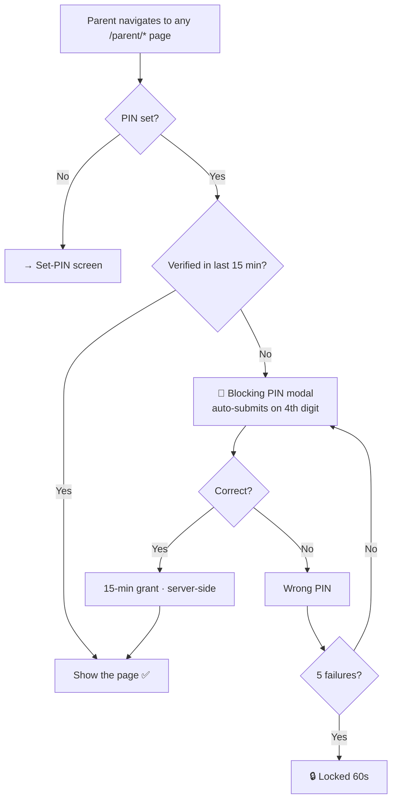
```mermaid
flowchart TD
    Enter[Parent navigates to any /parent/* page] --> Has{PIN set?}
    Has -->|No| Setup[→ Set-PIN screen]
    Has -->|Yes| Fresh{Verified in last 15 min?}
    Fresh -->|Yes| Allow[Show the page ✅]
    Fresh -->|No| Modal[🔢 Blocking PIN modal<br/>auto-submits on 4th digit]
    Modal --> Ok{Correct?}
    Ok -->|Yes| Grant[15-min grant · server-side] --> Allow
    Ok -->|No| Fail[Wrong PIN]
    Fail --> Lock{5 failures?}
    Lock -->|Yes| Locked[🔒 Locked 60s]
    Lock -->|No| Modal
```

- A successful PIN grants **15 minutes** of access (tracked server-side in the session).
- 🔒 **Brute-force protection:** 5 wrong attempts → 60-second lockout.
- **Exempt from PIN:** the login page, onboarding, **switching between child profiles**, and the entire student portal. Switching kids is intentionally frictionless; entering parent settings is not.

### 5.3 Managing child profiles

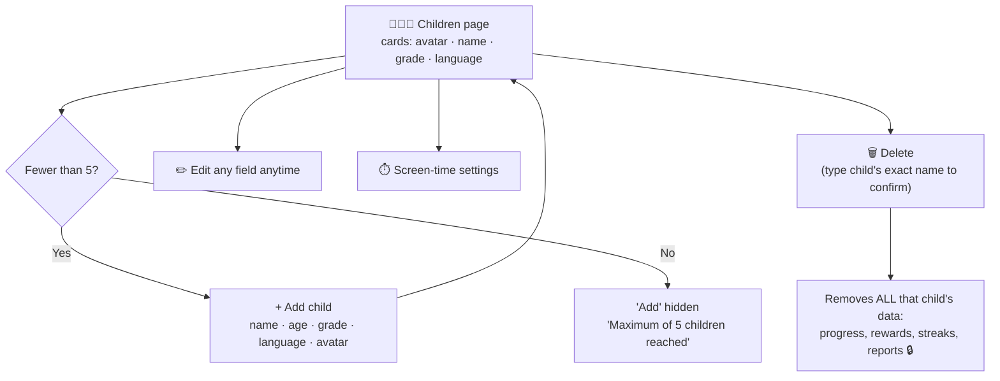
```mermaid
flowchart TD
    List["👨‍👩‍👧 Children page<br/>cards: avatar · name · grade · language"] --> Add{Fewer than 5?}
    Add -->|Yes| Create["+ Add child<br/>name · age · grade · language · avatar"]
    Add -->|No| Hidden["'Add' hidden<br/>'Maximum of 5 children reached'"]
    List --> Edit[✏️ Edit any field anytime]
    List --> ST[⏱️ Screen-time settings]
    List --> Del["🗑️ Delete<br/>(type child's exact name to confirm)"]
    Del --> Cascade[Removes ALL that child's data:<br/>progress, rewards, streaks, reports 🔒]
    Create --> List
```

- **Up to 5 profiles** per account; the Add button disappears at the limit.
- **Edit anything, anytime** — name, age, grade, language, avatar.
- 🔒 **Delete is guarded** — the parent must type the child's exact first name before the delete button enables, preventing accidental one-tap loss. Deletion cascades: all of that child's progress, quiz responses, rewards, streaks, screen-time settings, and reports are removed.

### 5.4 The dashboard

After the PIN gate, the parent sees a per-child summary. A child-switcher (tabs) sits at the top; the selected child persists in the URL.

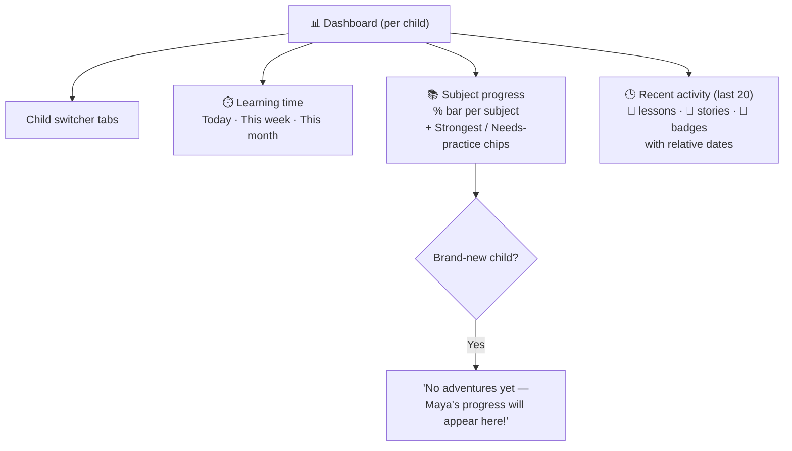
```mermaid
flowchart TD
    Dash["📊 Dashboard (per child)"] --> Tabs[Child switcher tabs]
    Dash --> Time["⏱️ Learning time<br/>Today · This week · This month"]
    Dash --> Subj["📚 Subject progress<br/>% bar per subject<br/>+ Strongest / Needs-practice chips"]
    Dash --> Recent["🕒 Recent activity (last 20)<br/>📘 lessons · 📖 stories · 🏅 badges<br/>with relative dates"]

    Subj --> Empty1{Brand-new child?}
    Empty1 -->|Yes| Friendly["'No adventures yet —<br/>Maya's progress will appear here!'"]
```

- **Learning time** in three ranges, formatted human-readably ("1h 35m"), computed server-side from session events.
- **Subject progress** as CSS progress bars, with "Strongest" and "Needs practice" highlight chips (suppressed for brand-new children so no one is shamed at zero).
- **Recent activity** — a timeline of the last 20 events with relative dates ("2 hours ago").
- 🎈 **Warm empty states** everywhere — never raw zeros or `NaN`.

### 5.5 Weekly reports

A digest generated per child, per week (Monday–Sunday), viewable anytime.

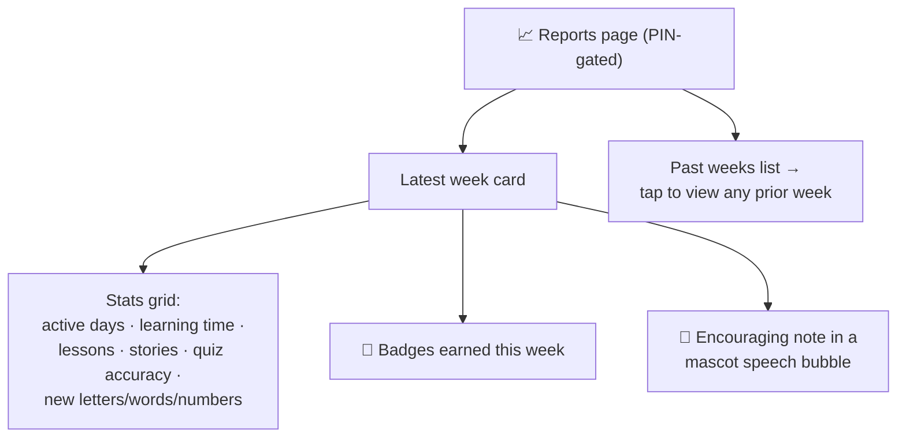
```mermaid
flowchart TD
    Open["📈 Reports page (PIN-gated)"] --> Latest["Latest week card"]
    Latest --> Stats["Stats grid:<br/>active days · learning time ·<br/>lessons · stories · quiz accuracy ·<br/>new letters/words/numbers"]
    Latest --> BadgesW[🏅 Badges earned this week]
    Latest --> Note["💬 Encouraging note in a<br/>mascot speech bubble"]
    Open --> Past["Past weeks list →<br/>tap to view any prior week"]
```

- Captures **active days, learning minutes, new letters/words/numbers encountered, lessons & stories completed, quiz accuracy (first-attempt), badges earned**, plus an **encouraging note**.
- The note is chosen from deterministic, localized templates (e.g., *"Amazing! You learned every single day this week!"* for a 7-day week; *"Every little bit counts!"* as a gentle fallback) — positive in every case.
- Reports are generated lazily on first view and/or by a weekly cron, and are idempotent (re-running never duplicates).

### 5.6 Screen-time controls

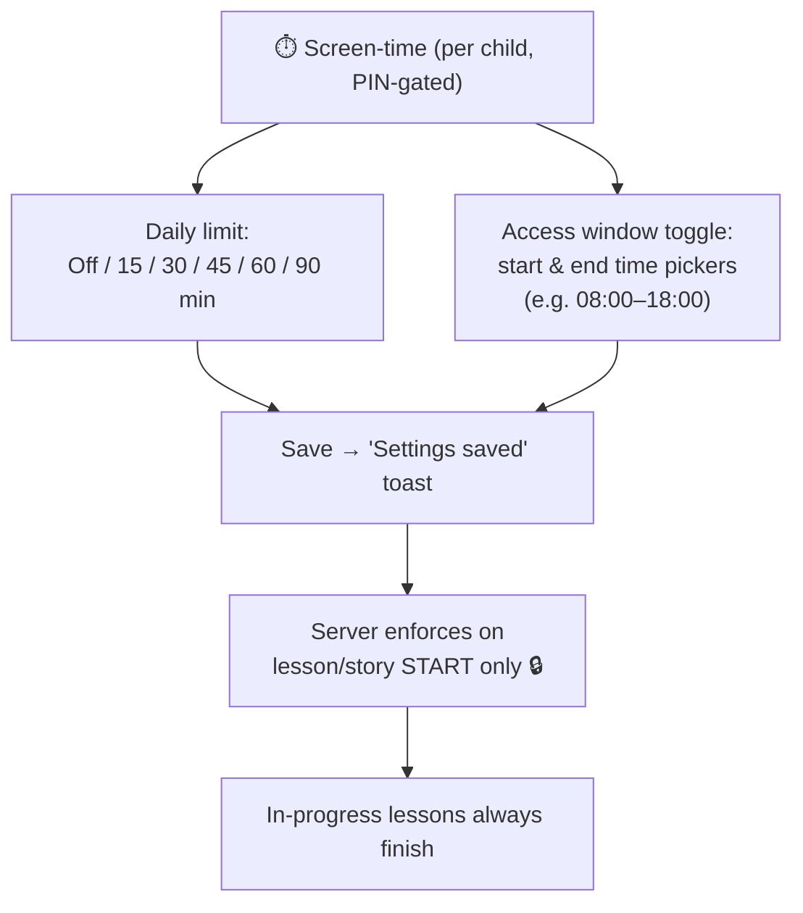
```mermaid
flowchart TD
    ST["⏱️ Screen-time (per child, PIN-gated)"] --> Limit["Daily limit:<br/>Off / 15 / 30 / 45 / 60 / 90 min"]
    ST --> Window["Access window toggle:<br/>start & end time pickers<br/>(e.g. 08:00–18:00)"]
    Limit --> Save[Save → 'Settings saved' toast]
    Window --> Save
    Save --> Enforce[Server enforces on<br/>lesson/story START only 🔒]
    Enforce --> InProg[In-progress lessons always finish]
```

- **Daily limit** and an optional **access-time window** (which may wrap past midnight, e.g., 20:00–07:00).
- 🔒 Enforcement is **server-side and applies only when starting new content** — so a child can always finish what they're in, and a page refresh can't buy extra minutes.

### 5.7 Account & data deletion

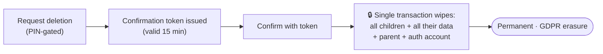
```mermaid
flowchart LR
    Req["Request deletion<br/>(PIN-gated)"] --> Token["Confirmation token issued<br/>(valid 15 min)"]
    Token --> Confirm["Confirm with token"]
    Confirm --> Wipe["🔒 Single transaction wipes:<br/>all children + all their data<br/>+ parent + auth account"]
    Wipe --> Gone([Permanent · GDPR erasure])
```

A two-step, intentional flow: request → confirm. On confirmation, **everything** is permanently erased in one transaction — all child profiles and their data, the parent record, and the auth account. No soft-delete (GDPR right-to-erasure).

---

## 6. Admin journey

The admin is the **content factory and the safety gate**. Their interface is a plain, professional, desktop-first CMS — deliberately the opposite of the child surface (no mascots, no pastels).

```mermaid
flowchart TD
    Login["🔐 /admin/login<br/>email + password"] --> CMS["CMS workspace<br/>(sidebar nav)"]
    CMS --> Curr[📚 Curriculum]
    CMS --> Stories[📖 Stories]
    CMS --> Media[🎬 Media]
    CMS --> Badges[🏅 Badges]
    CMS --> Queue["🤖 AI Queue<br/>(badge = pending count)"]
    CMS --> Analytics[📊 Analytics]
```

### 6.1 Login & workspace

- **`/admin/login`** — plain email + password (no signup, no password reset link at MVP). Admins are seeded internally; parent Google accounts are rejected from admin routes, and vice-versa.
- **Workspace** — a fixed left sidebar (collapses to a top bar under 768px) with six sections. The AI Queue item shows a live count badge of items awaiting review.

### 6.2 Building the curriculum

A three-pane tree: **Subjects → Topics → Lessons**, each draggable to reorder.

```mermaid
flowchart LR
    Subjects["Subjects pane<br/>create · reorder · archive"] -->|select| Topics["Topics pane<br/>create · reorder · status"]
    Topics -->|select| Lessons["Lessons pane<br/>create · reorder · preview · transition"]
    Lessons -->|click| Form["Lesson edit dialog<br/>(en / bn tabs)"]
    Form --> Fields["Title · intro script · narration script ·<br/>world · grade levels · video URLs ·<br/>activity ref · quiz ref"]
```

Lessons are authored per-locale (English/Bangla tabs) with title, intro script, narration script, world, grade levels, video URLs, and references to an activity and a quiz.

### 6.3 Media & content editors

```mermaid
flowchart TD
    Media["🎬 Media library"] --> Up["Upload (video/audio/image)"]
    Up --> Cloud["Direct upload to Cloudinary<br/>(bytes bypass our server)"]
    Cloud --> Register[Register asset → appears in grid]
    Register --> Attach["Attach to: lesson video ·<br/>story illustration · quiz audio/image ·<br/>world mascot · badge icon"]

    Editors["Content editors"] --> QE["Quiz question editor<br/>format → fields → LIVE validation<br/>→ live preview (real renderer)"]
    Editors --> AE["Activity editor<br/>type → fields → live preview"]
    Editors --> BE["Badge editor<br/>name · icon · rule type + params"]
```

- **Media upload** goes **directly to Cloudinary** — only the resulting URL/metadata is registered in the database.
- **Editors** validate against shared Zod schemas in real time and show a **live preview using the exact component the child will see** — what the admin builds is what the child gets.

### 6.4 The AI generation pipeline

AI produces content at scale; **a human always reviews before publication.**

```mermaid
flowchart TD
    Pick["Admin picks generator"] --> L["🤖 Lesson<br/>grade · subject · topic · focus · langs"]
    Pick --> S["🤖 Story<br/>grades · theme · world · langs · pages"]
    Pick --> Q["🤖 Quiz<br/>lesson · count · langs"]
    Pick --> N["🤖 Narration (audio)<br/>fills missing language audio"]
    Pick --> Img["🤖 Illustration (image)<br/>per story page"]

    L --> Job
    S --> Job
    Q --> Job
    N --> Job
    Img --> Job
    Job["AIGenerationJob created<br/>status: awaiting_review<br/>content saved as DRAFT"]
    Job --> RQ([→ Review Queue])
```

Each generator collects inputs, calls the model, validates the structured output (retrying once on a schema mismatch), and lands the result as **draft** content plus a job in the review queue. Nothing is auto-published — content sits invisible to students until approved. Daily rate caps protect cost.

### 6.5 The review queue — the human gate

This is the **single most important safety mechanism** in the whole system: no AI content reaches a child without a recorded human decision.

```mermaid
flowchart TD
    Queue["🤖 AI Queue<br/>filter by type/lang/grade"] --> Detail["Job detail<br/>read text · listen audio · view images"]
    Detail --> Decide{Reviewer decision}
    Decide -->|Approve| Pub["Walks content<br/>draft→in_review→approved→published<br/>✅ visible to students"]
    Decide -->|Edit then approve| Editor["Open editor pre-filled<br/>→ fix → save → publish<br/>(decision logged as edit_then_approve)"]
    Decide -->|Reject| Rej["Reason required (≥10 chars)<br/>content → rejected, never shown 🔒"]
    Editor --> Pub

    Pub -.blocked if.-> Guard{Pending image<br/>placeholders?}
    Guard -->|Yes| Stop["⛔ Must replace before publishing"]
```

🔒 **Hard invariant:** any AI-originated row is *forbidden* from reaching `published` unless its job carries an `approve` or `edit_then_approve` decision — enforced server-side, with no bypass path. Every decision (who, when, why) is logged for audit.

### 6.6 Publishing lifecycle

All content — human- or AI-authored — moves through one status machine. Only `published` is visible to students.

```mermaid
stateDiagram-v2
    [*] --> draft
    draft --> in_review: Submit for review
    draft --> archived: Archive
    in_review --> approved: Approve
    in_review --> rejected: Reject
    in_review --> draft: Withdraw
    approved --> published: Publish
    approved --> draft: Reopen
    rejected --> draft: Rework
    rejected --> archived: Archive
    published --> draft: Unpublish
    published --> archived: Archive
    archived --> draft: Restore
    published --> [*]: visible to students
```

🔒 There is **no direct `rejected → published` edge** — rejected content must re-earn approval through the full chain. The student query filters to `published` only, so drafts, in-review, and rejected items can never leak to a child.

---

## 7. Cross-cutting: how content reaches a child

Tying the three journeys together — the full lifecycle of one lesson, from idea to a child's smile:

```mermaid
flowchart LR
    A1["🛠️ Admin generates/authors lesson"] --> A2["🤖 Review queue"]
    A2 -->|human approves| A3["✅ Published"]
    P1["👩 Parent creates child profile<br/>(grade + language)"] --> P2["Sets daily limit + window"]
    A3 -->|filtered by grade+language| C1["👧 Child sees the lesson tile"]
    P2 -.gates start.-> C1
    C1 --> C2["Plays 5-step lesson"]
    C2 --> C3["🎉 Earns stars/coins/badges"]
    C3 --> S1["Server records progress + minutes"]
    S1 --> R1["📈 Parent sees it in dashboard<br/>+ weekly report"]
```

> **The loop closes:** the admin's approved content, bounded by the parent's settings, becomes the child's joyful adventure — and the child's joyful effort becomes the parent's weekly report. Three journeys, one virtuous circle.

---

## 8. UX principles summary

**For the child (the priority):**
- Joy over assessment. Encouragement over correction. Voice over text. There is no failure — only "not yet."
- Predictable structure (same 5 steps) creates safety; celebration creates the pull to return tomorrow.

**For the parent:**
- Trust through transparency (clear progress, honest reports) and control (PIN, limits) — with minimal friction for the things they do often (switching kids) and deliberate friction for the rare, dangerous things (deleting data).

**For the admin:**
- Efficiency through AI, safety through the mandatory human gate, and confidence through live previews and a complete audit trail.

**The thread through all three:** the child never sees the machinery. The parent and admin do all the work so that, for a 3-to-6-year-old, KidLearn feels like nothing more than a wonderful place to play and grow.

---

_End of User Journey & User Manual — KidLearn v1.0_
